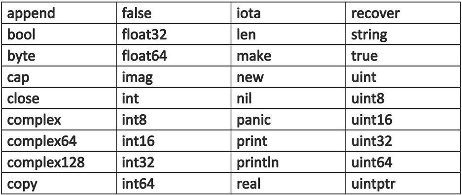
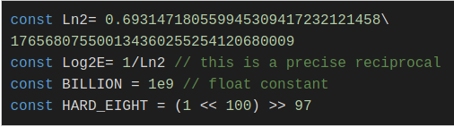
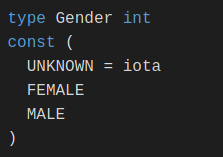
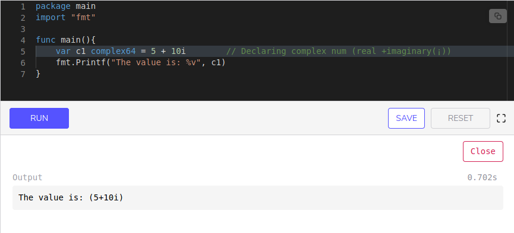
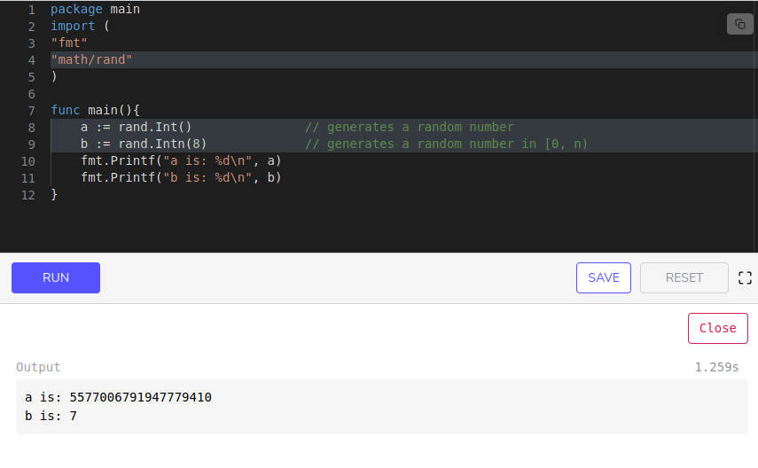
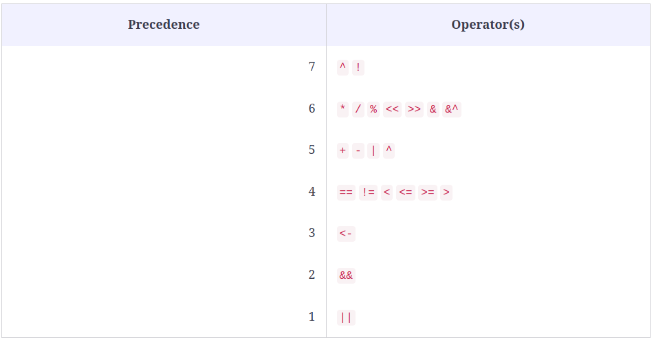

# The Way to Go
---

## *Caracteristicas de Go*

Go es esencialmente un lenguaje **imperativo** (*procedimental, estructural*), construido pensando en la concurrencia. No está realmente orientado a objetos como Java y C ++ porque no tiene los conceptos de clases y herencia. Sin embargo, tiene conceptos de interfaces, con los que se puede implementar gran parte del polimorfismo. Go tiene un sistema de tipos claro y expresivo, pero es ligero y sin jerarquías. Entonces, en este sentido, podría llamarse un lenguaje **híbrido**.

## *Usos de Go*

Go es muy potente y puede tener muchos usos, pero podemos diferenciar y nombrar 3 puntualmente:

- Usado como lenguaje de programacion de un sistema.
> Originalmente fue concevido para administracion de servidores, web servers, arquitectura de almacenamiento, etc.
- Usado como un lenguaje de programacion general.
> Util para resolver problemas de procesamiento de texto, crear interfaces o incluso aplicaciones similares a secuencias de comandos.
- Usado como un soporte interno.
> Go estuvo implementado en aplicaciones de alta carga como Google Maps.

---
**Nota:** A continuacion se tomara nota de contenidos relevantes del curso. Algunos apartados no seran contemplados ya que fueron desarrollados en **IntroToGo**. Ante la duda, dirigirse a dicho archivo.

### Palabras Clave

Nos encontramos con 25 palabras clave reservadas:

### Identificadores

Go contiene 36 **identificadores pre-declarados**:

###### Identificador Blanco

Como se vio en la introduccion del curso, el identificador blanco es el **"_"** el cual es usado para la declaracion o asignacion de variables que no nos interesan y pueden ser descartadas.

### Constantes

Los valores constantes son aquellos que no pueden ser cambiados por el programa en tiempo de ejecucion.

La declaracion de una constante se hace mediante la palabra clave **const**.  

Tenemos el tipo *explicito* de declaracion y el *implicito*.

- Explicito:

> **const** identifier [**type**] = value
> En este caso le aclaramos al compilador el tipo de variable que debe ser.

- Implicito:

> **const** PI **=** 3.14159
> Aqui por mas que no especifiquemos el *type* el compilador deriva la asignacion al mismo.

Las constantes numericas no tienen signo. Ademas son de alta precision arbitraria y no generan Overflow. Ejemplo:

*Nota*: Usamos \ (barra invertida) para declarar la constante Ln2 porque se puede utilizar como carácter de continuación en una constante.

Ademas, tenemos **Enumeraciones** que es la lista de todas las **constantes** utilizadas. Ejemplo:

> **cost** (
    var1 = 0
    var2 = 1
    var3 = 2
    )

Por ultimo, podemos asignar un *type* y un nombre a la enumeracion. Por ejemplo:

---

#### Tipos Elementales

Los tres tipos principales en GO son:

+ Boolean
+ Numerico
+ Caracter

Nos centraremos en Numerico para explorar un poco mas.

###### Tipos de Numericos

*Numeros enteros y de Coma flotante:*

La arquitectura de Go depende de tipos como **int, uint y uintptr**

Un **int** es un tipo con signo predeterminado, lo que significa que toma un tamaño de 32 bits (4 bytes) en una máquina de 32 bits y de 64 bits (8 bytes) en una máquina de 64 bits, lo mismo ocurre con **unit** (unsigned int). Mientras tanto, **uintptr** es un entero sin signo lo suficientemente grande como para almacenar un patrón de bits de cualquier puntero.

**Nota:** Nota: A diferencia de otros idiomas, un tipo flotante por sí solo no existe en Golang. Se deben especificar los bits. Por ejemplo, **float32** o **float64**.

Un **float32** tiene una precisión confiable de aproximadamente 7 lugares decimales y un **float64** de aproximadamente 15 lugares decimales. 

Utilice **float64** siempre que sea posible, porque todas las funciones del paquete matemático esperan ese tipo.

> *Formatos Especificos*
> - **%d** es usado para enteros.
> - **%g** para tipo flotantes (**%f** da un punto flotante y **%e** da una notación científica).
> - **%0nd** muestra un número entero con *n* dígitos, y es necesario un 0 inicial.
> - **%n.mg** representa el número con **m** dígitos después del signo decimal y **n** antes. En lugar de g, también se pueden utilizar **e** y **f**. Por ejemplo, el formato **%5.2e** del valor 3.4 da 3.40e + 00.

*Numeros Complejos:*

Un numero complejo se escribe de la forma:

> re + im`¡`
 Donde *re* es la parte real, *im* la imaginaria y *¡* la raiz a la menos uno. Para este tipo de dato tenemos los siguientes *types*:

 - **complex64** (32 bits para parte *re* e *im*) 
 - **complex128** (64 bits para parte *re* e *im*)

 Ejemplo:

 

 Si *re* y *im* son de *float32* y sea una variable *c* del tipo *complex64*, esta ultima puede ser inicializada con la funcion complex:

 > c = **complex(re, im)**

Tambien podemos desde un numero complejo extraer su parte real e imaginaria mediante las funciones **real(c)** e **imag(c)**.

*Numeros Aleatorios:*

El paquete *"math/rand"* implementa generadores de numeros pseudo aleatorios.

- Ejemplo:

> Para la funcion *Intn(n)* el rango de valores que nos devolvera sera de 0 a **n-1**.

# **Volver para el apartado caracteres*

---

### Operadores

Algunos operadores tienen prioridades más altas (precedencia) que otros. Los operadores binarios de la misma precedencia se asocian de izquierda a derecha. La siguiente tabla enumera todos los operadores y su precedencia (mucho más corta y clara que en C o Java), de arriba a abajo es de mayor a menor. 

