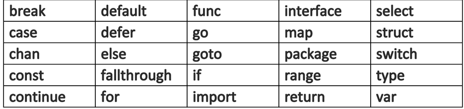

# The Way to Go
---

## *Caracteristicas de Go*

Go es esencialmente un lenguaje **imperativo** (*procedimental, estructural*), construido pensando en la concurrencia. No está realmente orientado a objetos como Java y C ++ porque no tiene los conceptos de clases y herencia. Sin embargo, tiene conceptos de interfaces, con los que se puede implementar gran parte del polimorfismo. Go tiene un sistema de tipos claro y expresivo, pero es ligero y sin jerarquías. Entonces, en este sentido, podría llamarse un lenguaje **híbrido**.

## *Usos de Go*

Go es muy potente y puede tener muchos usos, pero podemos diferenciar y nombrar 3 puntualmente:

- Usado como lenguaje de programacion de un sistema.
> Originalmente fue concevido para administracion de servidores, web servers, arquitectura de almacenamiento, etc.
- Usado como un lenguaje de programacion general.
> Util para resolver problemas de procesamiento de texto, crear interfaces o incluso aplicaciones similares a secuencias de comandos.
- Usado como un soporte interno.
> Go estuvo implementado en aplicaciones de alta carga como Google Maps.

---
**Nota:** A continuacion se tomara nota de contenidos relevantes del curso. Algunos apartados no seran contemplados ya que fueron desarrollados en **IntroToGo**. Ante la duda, dirigirse a dicho archivo.

### Palabras Clave

Nos encontramos con 25 palabras clave reservadas:

### Identificadores

Go contiene 36 **identificadores pre-declarados**:

###### Identificador Blanco

Como se vio en la introduccion del curso, el identificador blanco es el **"_"** el cual es usado para la declaracion o asignacion de variables que no nos interesan y pueden ser descartadas.

### Constantes

Los valores constantes son aquellos que no pueden ser cambiados por el programa en tiempo de ejecucion.

La declaracion de una constante se hace mediante la palabra clave **const**.  

Tenemos el tipo *explicito* de declaracion y el *implicito*.

- Explicito:

> **const** identifier [**type**] = value
> En este caso le aclaramos al compilador el tipo de variable que debe ser.

- Implicito:

> **const** PI **=** 3.14159
> Aqui por mas que no especifiquemos el *type* el compilador deriva la asignacion al mismo.

Las constantes numericas no tienen signo. Ademas son de alta precision arbitraria y no generan Overflow. Ejemplo:

*Nota*: Usamos \ (barra invertida) para declarar la constante Ln2 porque se puede utilizar como carácter de continuación en una constante.

Ademas, tenemos **Enumeraciones** que es la lista de todas las **constantes** utilizadas. Ejemplo:

> **cost** (
    var1 = 0
    var2 = 1
    var3 = 2
    )

Por ultimo, podemos asignar un *type* y un nombre a la enumeracion. Por ejemplo:

---

#### Tipos Elementales

Los tres tipos principales en GO son:

+ Boolean
+ Numerico
+ Caracter

Nos centraremos en Numerico para explorar un poco mas.

###### Tipos de Numericos

*Numeros enteros y de Coma flotante:*

La arquitectura de Go depende de tipos como **int, uint y uintptr**

Un **int** es un tipo con signo predeterminado, lo que significa que toma un tamaño de 32 bits (4 bytes) en una máquina de 32 bits y de 64 bits (8 bytes) en una máquina de 64 bits, lo mismo ocurre con **unit** (unsigned int). Mientras tanto, **uintptr** es un entero sin signo lo suficientemente grande como para almacenar un patrón de bits de cualquier puntero.

**Nota:** Nota: A diferencia de otros idiomas, un tipo flotante por sí solo no existe en Golang. Se deben especificar los bits. Por ejemplo, **float32** o **float64**.

Un **float32** tiene una precisión confiable de aproximadamente 7 lugares decimales y un **float64** de aproximadamente 15 lugares decimales. 

Utilice **float64** siempre que sea posible, porque todas las funciones del paquete matemático esperan ese tipo.

> *Formatos Especificos*
> - **%d** es usado para enteros.
> - **%g** para tipo flotantes (**%f** da un punto flotante y **%e** da una notación científica).
> - **%0nd** muestra un número entero con *n* dígitos, y es necesario un 0 inicial.
> - **%n.mg** representa el número con **m** dígitos después del signo decimal y **n** antes. En lugar de g, también se pueden utilizar **e** y **f**. Por ejemplo, el formato **%5.2e** del valor 3.4 da 3.40e + 00.

*Numeros Complejos:*

Un numero complejo se escribe de la forma:

> re + im`¡`
 Donde *re* es la parte real, *im* la imaginaria y *¡* la raiz a la menos uno. Para este tipo de dato tenemos los siguientes *types*:

 - **complex64** (32 bits para parte *re* e *im*) 
 - **complex128** (64 bits para parte *re* e *im*)

 Ejemplo:

 

 Si *re* y *im* son de *float32* y sea una variable *c* del tipo *complex64*, esta ultima puede ser inicializada con la funcion complex:

 > c = **complex(re, im)**

Tambien podemos desde un numero complejo extraer su parte real e imaginaria mediante las funciones **real(c)** e **imag(c)**.

*Numeros Aleatorios:*

El paquete *"math/rand"* implementa generadores de numeros pseudo aleatorios.

- Ejemplo:

> Para la funcion *Intn(n)* el rango de valores que nos devolvera sera de 0 a **n-1**.

# **Volver para el apartado caracteres*

---

### Operadores

Algunos operadores tienen prioridades más altas (precedencia) que otros. Los operadores binarios de la misma precedencia se asocian de izquierda a derecha. La siguiente tabla enumera todos los operadores y su precedencia (mucho más corta y clara que en C o Java), de arriba a abajo es de mayor a menor. 

---

#### ¡Desafio!

En el repositorio se encontrara una consigna para resolver, de esta manera se practicara la sintaxis y lo visto hasta el momento. Buscar en **./TheWayToGo/challenge_01**.

---
### Strings

###### Introduccion:

Las cadenas son una secuencia de caracteres UTF-8 (el código ASCII de 1 byte se usa cuando es posible y un código UTF-8 de 2-4 bytes cuando es necesario). UTF-8 es la codificación más utilizada. Es la codificación estándar para archivos de texto, archivos XML y cadenas JSON. Con el tipo de datos de cadena, puede reservar 4 bytes para caracteres, pero Go es lo suficientemente inteligente como para reservar un byte si la cadena es solo un carácter ASCII.

###### Ventajas de los **Strings** en Go:

- Las cadenas de texto y los archivos de texto ocupan menos memoria/espacio en disco (debido a los caracteres de ancho variable).
- Dado que UTF-8 es el estándar, Go no necesita codificar y decodificar cadenas como lo hacen otros idiomas.

###### Largo del String:

Las cadenas en Go no terminan con un carácter especial como en C/C++. El valor inicial de una cadena es la cadena vacía "". Los operadores de comparación habituales (== ,!= , <, <=, >= Y >) funcionan en cadenas comparando byte por byte en la memoria.

El largo del string (numero de bytes) esta dado por la funcion **len()**.

Recordar que:

- El primer byte de la cadena podemos acceder por **str[0]**
- El i-esimo byte: **str[i]**
- El ultimo byte por **str[len(str)-1]**

### Paquete *strconv*

###### Funciones del Paquete

- Dentro del paquete nos encontramos con funciones que nos permite encontrar *prefijos* y *sufijos*. Estas funciones son **HasPrefix** y **HasSuffix**.

*Prefijo:*
> strings.HasPrefix(s, prefix, **string**) **bool**

*Sufijo:*
> strings.HasSuffix(s, suffix **string**) **bool**

- Contamos con la funcion **Contains** que nos permite verificar si hay una cadena *string* dentro de otra.

> strings.Contains(s, substr **string**) **bool**

- La funcion **Index** nos devuelve el indice (numero) al primer elemento de la subcadena buscada e ingresada por parametro. La funcion devolvera **-1** en caso de no encontrar la subcadena.

> string.Index(s, str **string**) **int**

- **LastIndex** cumple el mismo objetivo que la funcion anterior pero para el primer elemento.

- Podemos remplazar *strings* con **Replace**

> strings.Replace(str, old, new **string**, n **int**)
n: indica el numero de apariciones que queremos reemplazar. 

- **Count** nos permite contar la cantidad de veces que se encuentra un caracter o sub cadena dentro de otra.

> string.Count(s, str **string**) **int**

- **Repeat** es una funcion que nos permite repetir una cadena un numero *n* de veces.

> strings.Repeat(s, count **int**) **string**

- Cambiar las mayusculas/minusculas de una cadena:

> string.ToLower(s) **string**
> string.ToUpper(s) **string**

- Remover los espacios en blanco de una cadena

> strings.TrimSpace(s)

- En caso de querer eliminar un caracter en especifico se puede utilizar la siguiente funcion:

> string.Trim(s, **str**) *donde str puede ser "\r\n"*

- Si solo se quiere remover los espacios finales e iniciales de una cadena, se puede utilizar **TrimLeft** o **TrimRight** respectivamente.

- Para partir una cadena podemos utilizar:

> strings.Fields(s) *Separa por espacios en blanco*.
> strings.Split(s, **sep**) *Separa la cadena por los caracteres ingresados por parametro*. 

El paquete strings también tiene una función llamada strings.NewReader (str). Esto produce un puntero a un valor de Reader, que proporciona, entre otras, las siguientes funciones para operar en str:

- Read() *para leer un byte*
- ReadByte() *lee el proximo byte del string*
- ReadRune() **? no se entiende, ver**

###### Conversion Desde y Hacia un String

El paquete strconv contiene algunas variables para calcular el tamaño en bits del **int** de la plataforma en la que se ejecuta el programa:

> strconv.IntSize

La conversión de una variable de cierto tipo en una cadena siempre se realizará correctamente. Para convertir de números, tenemos las siguientes funciones:

> strconv.Itoa(int **int**) **string**  *Devuelve la representación de cadena decimal de i*.

A continuacion, tenemos:

> strconv.FormatFloat(f **float64**, fmt **byte**, prec **int**, bitSize **int**) **string**

Convierte el número de coma flotante de 64 bits f en una cadena, de acuerdo con el formato fmt (puede ser 'b', 'e', 'f' o 'g'), precisión prec, siendo bitSize **32** para **float32** o **64** para float64.

*Para convertir a numeros, hacemos lo siguiente:*

> strconv.Atoi(s **string**) (i **int**, err **error**) *Convertir a entero*

Para convertir a  punto flotante de **64 bits**:

> strconv.ParseFloat(s **string**, BitSize **int**) (f **float64**, err error)

Aqui recordamos que hay funciones que devuelven 2 valores, por lo tanto, tendremos que hacer la asignacion multiple.

- Por ejemplo:
> val, err = strconv.Atoi(s)

### Fecha y Tiempo

Dentro del lenguaje nos encontramos con el paquete **time**. Dentro de este paquete nos encontramos varias funciones como:

- **time.Now()** *Hora actual*
- **t.Dat()**
- **t.Day()**
- **t.Minute()**

Otra funcion util es Since(t **Time**) que devuelve el tiempo transcurrido desde **t**, el cual le podemos dar un formate definido con la sintaxis:

> **func** Since(t **Time**) Format(s **string**) **string**

*Para mas informacion, leer la documentacion de **GoLand***. Link [aqui](https://golang.org/pkg/time/).

---

### Punteros

